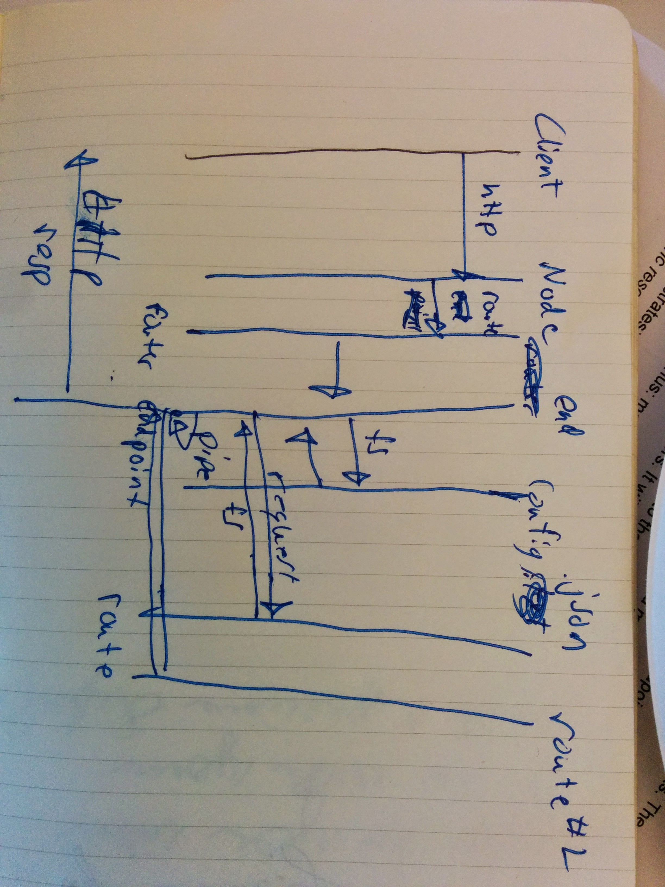

node-aggregation-server
=======================

Node Aggregation Server for Node Training

## Architecture

Initial architecture design

Overall the architecture plan is to create an http server and use the request stream as the initial stream that will be piped to each down stream request.  It will aggregate all the down stream requests into the initial stream and pipe the results to the response of the request.
